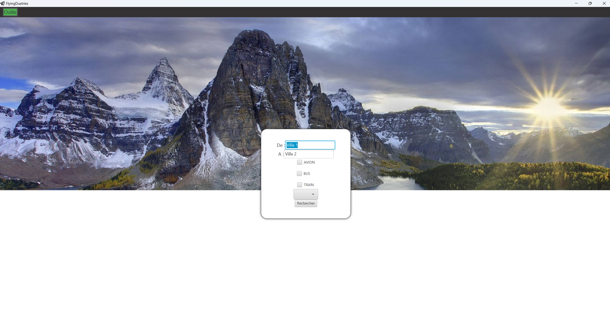
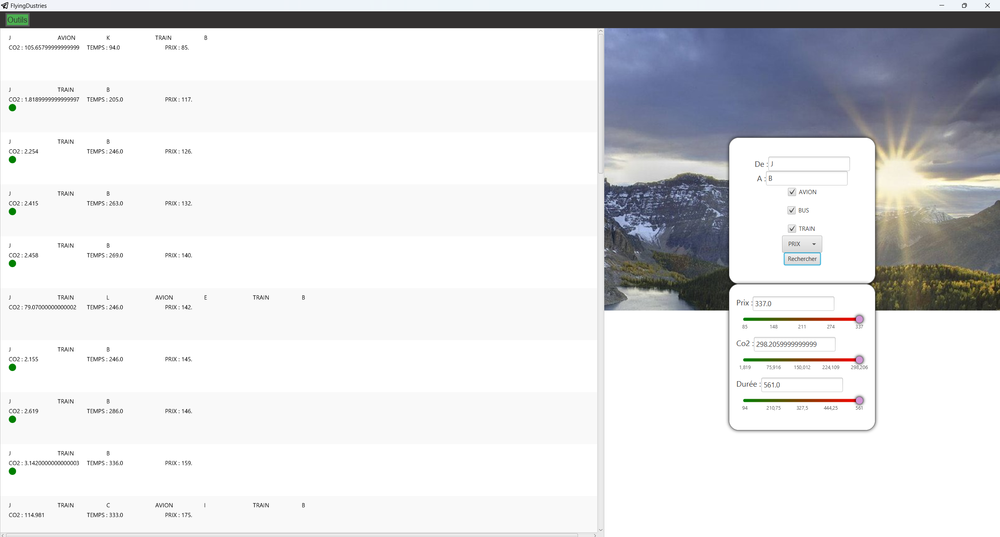

# Flagothier Lorenzo , Dylan Zhang , Nathan Marquis  Groupe B3

## Prototypage basse fidélité :

**[IHM Figma](https://www.figma.com/proto/Wfr9uPcfXBT80VY3P87YkM/Untitled?node-id=0-1&t=0aYEJk56IBQvRm3D-1)**

## Lien du depot Git : 

**[IHM Git](https://gitlab.univ-lille.fr/sae2.01-2.02/2024/B3)**

## une partie sur la justification de vos choix de conception au regard des critères ergonomiques, guide de conception : 

### Simplicité et Clarté
Nous avons adopté le principe de simplicité pour assurer que l'interface utilisateur soit claire et facile à comprendre. Chaque élément de l'interface a été soigneusement choisi pour éviter la surcharge cognitive des utilisateurs.

- Disposition claire et intuitive : Nous avons organisé les éléments de manière logique et cohérente, en utilisant des grilles et des alignements pour structurer l'information. Cela aide les utilisateurs à trouver rapidement ce qu'ils cherchent.

- Utilisation minimale des couleurs et des styles : En nous limitant à une palette de couleurs restreinte et cohérente, nous avons évité la confusion et renforcé l'identité visuelle de l'application.
### Consistance
La consistance est un principe clé en ergonomie, car elle permet aux utilisateurs de prédire et de comprendre le comportement de l'application sans effort.

- Styles et composants uniformes : Grâce au travail de Dylan sur le style.css, nous avons assuré une apparence homogène à travers toute l'application. Les boutons, les formulaires et les icônes suivent tous les mêmes normes visuelles.

- Terminologie cohérente : Les labels, les messages et les instructions utilisent un vocabulaire uniforme, ce qui réduit le risque de confusion.
### Retour d'information
Nous avons intégré des mécanismes de retour d'information pour informer les utilisateurs de l'état et des résultats de leurs actions.

- Messages de confirmation et d'erreur : Nous avons ajouté des notifications claires et visibles pour indiquer le succès ou l'échec des actions de l'utilisateur.

### Accessibilité
Nous avons pris en compte les directives d'accessibilité pour s'assurer que notre application soit utilisable par le plus grand nombre, y compris les personnes ayant des handicaps.

- Contraste des couleurs : Nous avons vérifié que le contraste entre le texte et les arrière-plans soit suffisant pour être lisible par les utilisateurs malvoyants.
Navigation au clavier : L'application peut être partiellement naviguée à l'aide du clavier, facilitant l'accès pour les utilisateurs ayant des limitations motrices.

En nous basant sur ces principes ergonomiques et en suivant des guides de conception tels que les directives de Material Design et les normes W3C pour l'accessibilité, nous avons conçu une application qui non seulement est esthétiquement plaisante, mais aussi fonctionnelle et inclusive. Cela nous a permis de créer une expérience utilisateur fluide et intuitive.

## une partie qui détaille les contributions de chaque membre du groupe. Comment vous avez réussi à exploiter au mieux les compétences de chacun ?

Dans notre projet, chaque membre de l'équipe a apporté des compétences spécifiques et complémentaires, ce qui nous a permis de tirer le meilleur parti de nos forces individuelles pour créer une application harmonieuse et fonctionnelle. Voici une répartition détaillée des contributions de chaque membre du groupe :

### Dylan
- Dylan a joué un rôle crucial en se concentrant principalement sur le développement du style.css. Grâce à ses compétences en design et en CSS, nous avons pu obtenir une application visuellement attrayante et cohérente. Il a veillé à ce que chaque élément de l'interface utilisateur soit stylisé de manière élégante et professionnelle, améliorant ainsi l'expérience utilisateur globale. En parallèle, Dylan a également apporté son aide précieuse au reste de l'équipe sur divers aspects de JavaFX, offrant des conseils et des solutions pour intégrer correctement le style avec les fonctionnalités de l'application.

### Nathan
- Nathan s'est principalement concentré sur l'implémentation des fonctions Java au sein du code JavaFX. Sa maîtrise de la programmation orientée objet et de Java nous a permis de développer des fonctionnalités robustes et efficaces. Il a travaillé intensivement sur l'intégration des fonctionnalités backend avec l'interface utilisateur, assurant une communication fluide entre les différentes parties de l'application. Nathan a également été essentiel dans le débogage et l'optimisation du code, garantissant ainsi la performance et la stabilité de notre application.

### Lorenzo
- Lorenzo a pris en charge la création du rendu basse fidélité et la conception de la plupart de l'interface utilisateur (IHM) qui n'était ni liée à l'implémentation des fonctions ni au style CSS. Son travail sur les maquettes basse fidélité nous a fourni une vision claire et structurée de l'application dès le début du projet. Cela a permis de définir une direction claire pour le développement et d'aligner les attentes de l'équipe. De plus, Lorenzo a conçu les composants de l'interface utilisateur, en se concentrant sur l'ergonomie et la convivialité, ce qui a considérablement amélioré l'interaction utilisateur.

### Exploitation des compétences
- Nous avons exploité au mieux les compétences de chacun en répartissant les tâches de manière stratégique selon les forces individuelles. Cette approche a permis à chaque membre de l'équipe de se concentrer sur ses domaines d'expertise, tout en collaborant étroitement pour intégrer leurs travaux de manière cohérente. Les réunions régulières et les sessions de partage de connaissances ont facilité la synergie entre les différentes contributions, assurant que chaque composant de l'application était optimisé et aligné avec les objectifs du projet.

En somme, la complémentarité de nos compétences et la coordination efficace ont été des facteurs clés dans le succès de notre projet. Chacun a pu s'épanouir dans son rôle tout en contribuant activement au résultat final, démontrant ainsi la puissance du travail d'équipe bien orchestré.