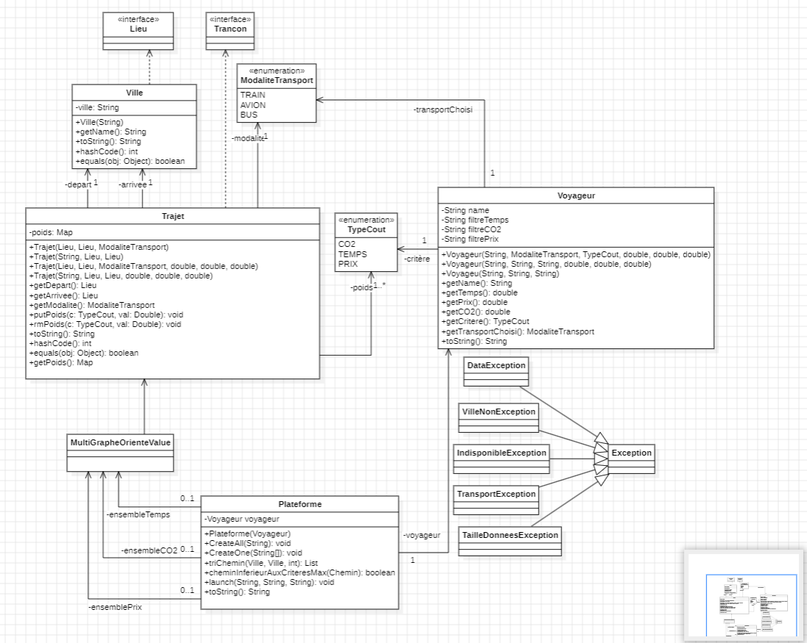
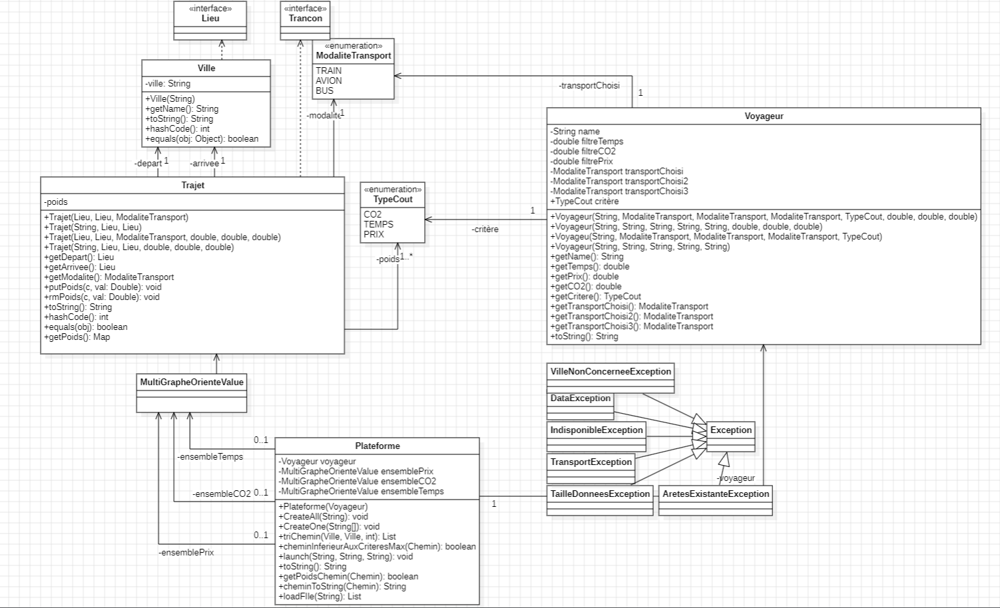

# Rapport de POO 

## Rapport POO Version 1

---

Manière de lancement : **Run** du debugger java 

### Diagramme UML avec *StarUML* :

### Analyse technique 

Dans cette version nous avons pris en compte des différentes class et interface mise à disposition afin de les utilisés dans notre programme java. 
Nous avons utiliser la librairie de graphe pour calculer les chemins les plus courts en prenant un type **CO2**, **Prix** ou **Temps**.

La class [Plateforme.java](https://gitlab.univ-lille.fr/sae2.01-2.02/2024/B3/-/blob/4aa2b6650212341fa3f2b8fbd9339ec0512e8b80/src/Plateforme.java) nous permet de calculer les chemins les plus courts en prenant compte du critère choisi.

On a implémenté des exceptions dans notre code java afin de mieux les traiter en cas d'erreur.

### Analyse quantitative/qualitative des tests

Les class de test **[UsePlateforme.java](https://gitlab.univ-lille.fr/sae2.01-2.02/2024/B3/-/blob/7296b70ecf4004961a71a3062498d647e87bead6/src/UsePlateforme.java)** et **[UsePlateformeAlice.java](https://gitlab.univ-lille.fr/sae2.01-2.02/2024/B3/-/blob/7296b70ecf4004961a71a3062498d647e87bead6/src/UsePlateformeAlice.java)** , 
nous permet de tester les fonctionnalité de la version 1 de la SAE, c'est à dire prendre en compte un ville de départ, arrivé et un critère.
Grace à ces testes on peut vérifier le bon fonctionnement du code quand l'utilisateur choisi un critère et que les deux autres critère ne seront pas prisent en compte.

---

## Rapport POO Version 2

---

Manière de lancement : **Run** du debugger java 

---

### Diagramme UML avec *StarUML* :

### Analyse technique

Dans cette personne nous avons mis en place une methode scanner dans [Plateforme.java](https://gitlab.univ-lille.fr/sae2.01-2.02/2024/B3/-/blob/bbcd88b4e36a03721d3fa8fb6254064972287630/src/Plateforme.java) afin de pouvoir lire les données CSV tout en passant par une vérification des donnés et si jamais la vérification échoue, le code renvoie une exception.
L'ajout de la multi modalite permet de mettre en place les correspondances entre chaque ville et de pouvoir changer de modalite de transport entre chaque correspondance, 
 sauf qu'on a pas réussi a implémenter les poids des correspondances donc les différent type CO2 Prix et Temps . 

### Analyse quantitative/qualitative des tests

La class de test [UsePlateformeAlice.java](https://gitlab.univ-lille.fr/sae2.01-2.02/2024/B3/-/blob/8da8ced1c8eb1d5f572ad2a9d53aa5832e9a4778/src/UsePlateformeAlice.java) a été modifié pour couvrir les nouveaux implementation du scanner et de pouvoir vérifier la multi modalite étant donné qu'on à ajouté des critère de correspondance dans les paramètres du constructeur de [Voyageur.java](https://gitlab.univ-lille.fr/sae2.01-2.02/2024/B3/-/blob/8da8ced1c8eb1d5f572ad2a9d53aa5832e9a4778/src/Voyageur.java).

---

## Rapport POO Version 3

---

Manière de lancement : **Run** du debugger java 

---

### Diagramme UML avec *StarUML* :

### Analyse technique

On a mis en place une historique via la sérialisation des objets dans [Plateforme.java](https://gitlab.univ-lille.fr/sae2.01-2.02/2024/B3/-/blob/8da8ced1c8eb1d5f572ad2a9d53aa5832e9a4778/src/Plateforme.java), la methode n'a pas été assez developpé pour pouvoir l'utiliser pleinement dans le code notamment dans l'application graphique.

### Analyse quantitative/qualitative des tests

La même class de test [UsePlateformeAlice.java](https://gitlab.univ-lille.fr/sae2.01-2.02/2024/B3/-/blob/8da8ced1c8eb1d5f572ad2a9d53aa5832e9a4778/src/UsePlateformeAlice.java) sera utilisé pour tester la serialisation.

